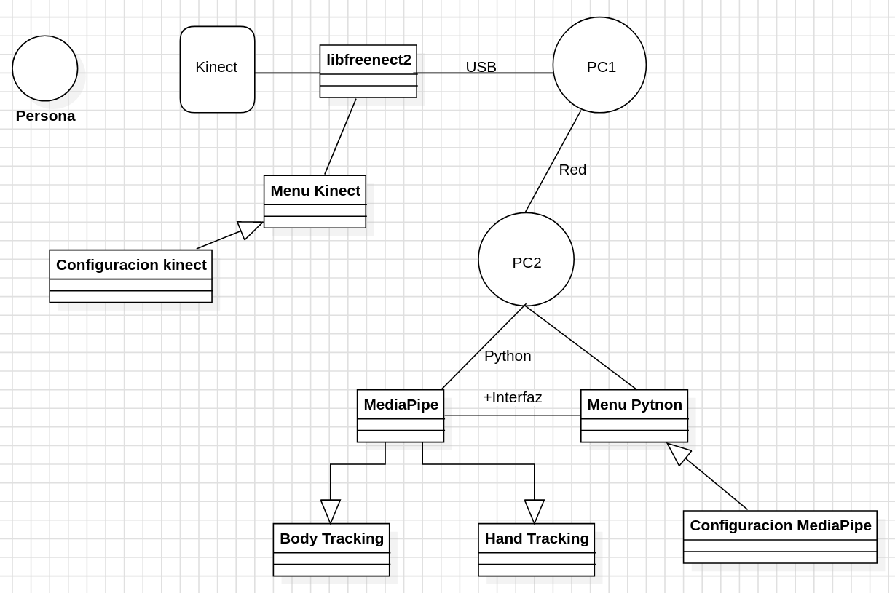

# KinectUSS
Proyecto de estudiantes de la USS basado en el bodytracking, utilizando la Kinect 2.0 usando el driver de [libfreenect2 de OpenKinect](https://github.com/OpenKinect/libfreenect2) junto a diversas librerias como MediaPipe y OpenCV.

  Este proyecto busca trackear los movimientos del individuo, calculando el angulo de movimiento de sus extremidades para poder detectar si el movimiento deseado esta realizado de manera correcta o si existe un margen de error del individuo.
  
https://github.com/ctellol/KinectUSS/assets/102624847/979460d9-7f28-452d-a14e-0bf865e7de0c

https://github.com/ctellol/KinectUSS/assets/102624847/12ddbc10-a729-4def-8c80-8088356c3c58

## Funcionamiento

El proyecto sigue este funcionamiento:

    

El funcionamiento se basa en 2 computadores, uno en conectado a la Kinect, y otro usando el MediaPipe, demostrando el uso remoto que se le puede dar a este proyecto.

## Instalacion

Como este proyecto cuenta de dos interfaces, Kinect y MediaPipe, hay instalaciones propias de cada una.

- [Kinect](Kinect/kinect.md)
- [MediaPipe](MediaPipe/mediapipe.md)

## Corriendo el proyecto

Una ves funcionando alguna, o ambas partes del proyecto nos dirigiremos a [Corriendo Kinect](doc/correr_kinect.md) o a [Corriendo MediaPipe](doc/correr_mediapipe.md).

## Creditos

A todos los panas
